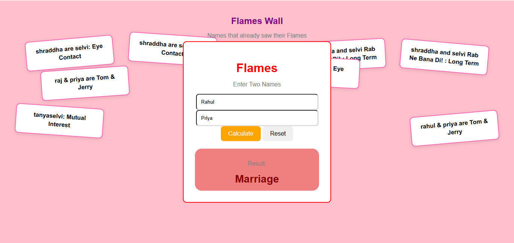

# Flames Public Wall

No pages left at teh back of ur Notebook ? Dont worry you can us ethis Falmes Website to calculate your result!

## Description

whether u wnat to check ur flames outcome .post your mathc on the public though "Flames Wall" , or want to share it , this project has coveered for u .

(And i u didnt get the result u wnated  ... feel free to for the repo and manipulate the script , that's what we can do we cant change fate though )

# Screenshots

# Getting Started 
## Dependencies
Any modern web browser (Chrome, Firefox, Safari, Edge)

Internet connection.

## Installing 
No installation needed! Just visit the live link: https://md-althaf.github.io/Flames/

## Executing program

Executing program
How to run and get ur result:

Open the link (https://md-althaf.github.io/Flames/) 

Enter Both Names.

Click Calculate.

It will calculate ur flames result in database and u get ur result on Flames Wall.

## Help
Result not saving. Make sure ur iternet connection is active so it can update the database.

# Made BY Md-Althaf Alias Bose-Nova